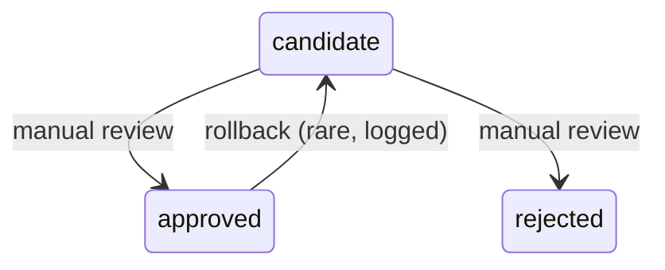

# 🏷️ `contracts/tagging_contract.md` (v0.4)

**Status:** Final (v0.4)
**Updated:** 2025‑10‑07
**Maintainer:** PHI Data Contracts
**Supersedes:** Tagging Contract v0.3 (2025‑10‑06) — see changelog

---

## 📘 Why This Exists

Tags are how we classify skills, scenes, characters, and other canon entities across the Primal Hunter Index. This
contract defines:

- The **tagging vocabulary**
- The **schema for tag records**
- The **promotion and approval process**
- The **validation and enforcement rules**
- The **tooling requirements and gating logic**

---

## 🧾 Changelog

### v0.4 (2025‑10‑07)

- 🔐 Added canonical tooling requirements for `promote_tags`, `approve_tags`, and validator behavior
- 🗃 Defined `tag_registry.meta.json` sidecar structure (with `record_log[]` and `source_ref[]`)
- 🔄 Formalized tag lifecycle state machine
- 🔧 Added validation matrix and cross-file invariants
- ❌ Prohibited LLMs from self-approving tags

---

## 🌱 Core Principles

- **Design first:** docs → schemas → code
- **Sidecars carry process, canon carries facts**
- **Heuristic ≠ Canon:** tags start unapproved
- **Everything referencable has a stable ID:** tags included
- **Tag usage must be explainable and validated**
- **Codex proposes — humans approve**

---

## 🧭 Vocabulary & Fields

### 🆔 Identity

- `tag_id` (string): Full stable ID (`tag.<namespace>.<slug>`)
- `tag` (string): Local inline name (`slug` only)

### 🧩 Classification

- `type`: What this tag classifies (skill, scene_type, entity, etc.)
- `tag_role`: Why it exists

| Value           | Meaning                                 |
| --------------- | --------------------------------------- |
| `heuristic`     | scraped/suggested, not verified         |
| `canonical`     | verified, used in canon                 |
| `test_data`     | scaffolding, never approved             |
| `manual_only`   | too subtle for automation               |
| `inferred_only` | never literal; applies only if inferred |

### 🔁 Lifecycle

- `status`: `candidate` | `approved` | `rejected`
- `approved`: `true` only if `status == "approved"`

### 🧷 Metadata

- `allow_inferred`: If true, tag may be applied contextually
- `aliases[]`: Optional synonyms (not used in canon)
- `description`: Required human-readable label
- `source`: Where it came from
- `notes`: Strict; avoid metaphorical use. Used for human guidance (e.g., usage restrictions, metaphor exclusions,
  domain context).
- `reviewed_by` / `reviewed_at`: Optional, for audit trail

---

## 📁 File Roles & Formats

### 1) `tagging/tag_candidates.json`

> Loose scraped/tagged vocab — not canon.

- String or object entries
- Minimal fields allowed
- `approved: true` is forbidden here

### 2) `tagging/tag_registry.json`

> Canon tag definitions.

- Fully typed objects
- Must follow schema
- Only `approved` tags may be used in canon files

### 3) Inline usage in records / timelines

```json
"tags": {
  "skills": ["basic_archery"],
  "scene_type": ["romantic_scene"]
}
```

Only `approved` tags may be used. Tag slug (`"basic_archery"`) must resolve to a `tag_id` in the registry.

### 4) `tagging/tag_registry.meta.json`

> Sidecar for all approved tags.

Required for every `status: "approved"` tag. Must include:

```json
{
  "tag.skills.basic_archery": {
    "index_meta": {
      "added_by": "assistant",
      "reviewed_by": "user",
      "reviewed_at": "2025-10-07",
      "method": "promote_tags"
    },
    "record_log": [
      { "action": "added", "by": "assistant", "date": "2025-10-06" },
      { "action": "approved", "by": "user", "date": "2025-10-07" }
    ],
    "source_ref": [
      {
        "type": "scene",
        "scene_id": "01.01.03",
        "line_start": 80,
        "line_end": 94,
        "quote": "He loosed the arrow like he’d done it a hundred times before."
      }
    ]
  }
}
```

---

## 🧪 Tooling Requirements

| Tool              | Role                                 | Required Behavior         |
| ----------------- | ------------------------------------ | ------------------------- |
| `promote_tags.py` | Normalize candidate → registry entry | - Must never auto-approve |

- Must write `status: "candidate"`
- Must generate `tag_id` from `tag` slug |
| `approve_tags.py` | Flip tag to canon | - Only humans may approve
- Must write `status: "approved"` + `approved: true`
- Must write/update meta sidecar with `record_log[]` and `source_ref[]` (unless `allow_inferred: true`) |
| `validate_tag_usage.py` | Enforce inline usage rules | - All inline tags must resolve to `status: "approved"`
- If no literal match, tag must allow `allow_inferred: true` |
| `tag_registry_lint.py` | Registry QA | - Checks ID format
- Enforces `status ↔ approved` invariant
- Validates `tag_id` uniqueness
- Flags orphaned sidecars or mismatches |

---

## 🔄 Tag State Machine



### Requirements per transition

- `→ approved`:

  - Set `approved: true`, `status: "approved"`
  - Sidecar must exist
  - `record_log[]` must include `"approved"` action by `"user"`
- `→ rejected`:

  - Keep for audit if needed
  - Must not be used in canon
- Rollbacks:

  - Must update sidecar with explanation

LLMs (Codex) **may not** flip status.

---

## 🔍 Validation Matrix

| File                     | Enforced Rules                                                                                         |
| ------------------------ | ------------------------------------------------------------------------------------------------------ |
| `tag_candidates.json`    | Must not contain approved tags                                                                         |
| `tag_registry.json`      | Full schema; status/approved match; stable IDs required                                                |
| `tag_registry.meta.json` | One sidecar per approved tag; must include `source_ref[]` unless `allow_inferred: true`                |
| Inline tags              | Must resolve to approved registry entry; if applied without literal match, tag must allow inferred use |

> **See also:** [Provenance Contract §9 — Enforcement & Tooling](provenance_contract.md#9-enforcement--tooling)  
> When `allow_inferred` is `false`, all canonical uses of that tag require a `source_ref[]` quote.  
> This rule ensures provenance consistency between tag approval and tag application.
> promote_tags.py must always perform a dry-run validation before any write operation.

---

## 🔥 Anti‑Patterns

| ❌ Pattern                                  | 🚨 Why it Fails                 |
| ------------------------------------------ | ------------------------------- |
| Inline tag not in registry                 | Breaks LLM RAG and audit        |
| `status: "approved"` but `approved: false` | Validation conflict             |
| Approved tag with no sidecar               | No provenance                   |
| Codex flipped `status`                     | LLMs cannot approve canon       |
| Registry has tag_id collision              | Cannot safely reference or diff |

---

### 🧩 CLI Implementation Requirements

All tag-promotion tooling must conform to these guardrails:

| Rule | Description |
|------|--------------|
| **Dry-run first** | CLIs must default to non-destructive (`--commit` required for writes). |
| **Mutually exclusive selectors** | `--all`, `--ids`, and `--grep` flags are exclusive to prevent accidental global promotions. |
| **Schema validation** | Must validate output against `schemas/tag_registry.schema.json` before commit. |
| **Atomic writes** | All writes go through `core/io_safe.write_json_atomic()` to prevent partial file corruption. |
| **Backups** | `--backup` flag writes a timestamped `.bak` copy alongside commits. |

Violations of these rules are treated as **pipeline errors**, not user mistakes.

---

## Draft Notes

These mini-schemas are fully redundant with your actual schema files (schemas/source_ref.schema.json and schemas/tags.schema.json).
But the idea of keeping fragments inline in docs as reference examples is excellent. You can reuse them in the appendices section of any contract.

📍Action:

Copy the tags fragment to the bottom of tagging_contract.md as a fenced JSON reference (under a heading like “Reference Schema Fragment”).

You can drop the source_ref one, since your dedicated source_ref_contract.md already embeds that schema inline with better comments.

- Appendix — Mini Schemas
  - source_ref fragment:

    ```json
    {
      "type": "object",
      "required": ["type"],
      "properties": {
        "type": { "enum": ["scene", "wiki", "user", "inferred", "external"] },
        "scene_id": { "type": "string", "pattern": "^\\d{2}\\.\\d{2}\\.\\d{2}$" },
        "line_start": { "type": "integer", "minimum": 1 },
        "line_end": { "type": "integer", "minimum": 1 },
        "quote": { "type": "string", "maxLength": 400 }
      },
      "allOf": [
        {
          "if": { "properties": { "type": { "const": "scene" } } },
          "then": { "required": ["scene_id", "line_start", "line_end"] }
        }
      ]
    }
    ```

  - tags fragment:

    ```json
    {
      "type": "object",
      "patternProperties": {
        "^[a-z_]+$": {
          "type": "array",
          "items": { "type": "string", "pattern": "^[a-z0-9_]+$" },
          "uniqueItems": true
        }
      },
      "additionalProperties": false
    }
    ```

## 🧠 Design Notes

- Canon tags are *not just keywords* — they are validated semantic objects with provenance.
- Sidecars let us track who approved what and **why** — and let Codex propose tags safely without promotion.
- You can train, tag, diff, and RAG off these without ever breaking canon.

---

## 📎 Related Contracts

- [`provenance_contract.md`](provenance_contract.md)
- [`record_log_contract.md`](record_log_contract.md)
- [`source_ref_contract.md`](source_ref_contract.md)
- [`id_contract.md`](id_contract.md)
- **Related ADR:** [`ADR-0001: Tagging Dual Role & Status`](../adr/ADR-0001-tagging-dual-role-and-status.md) — decision
  record establishing separation of `tag_role` (purpose) and `status` (lifecycle) to clarify approval flows in v0.4.

---

---

### Related Docs

- [Tagging Process Runbook](../runbooks/tagging_process_runbook.md)
- [Provenance Contract](./provenance_contract_v2.0.md)
- [Tag Registry Schema](../design/tagging_overview.md)
- [tools/promote_tags.py](../tools/promote_tags.py)
